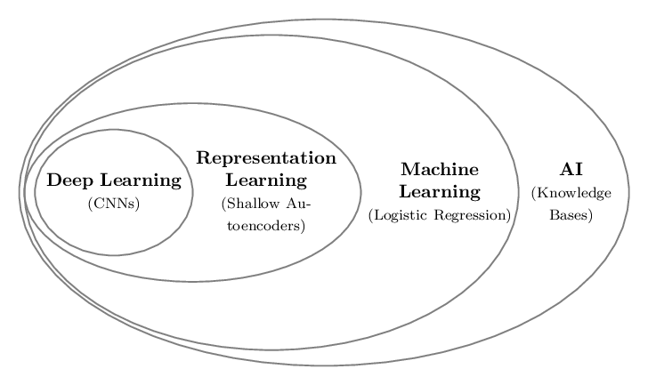
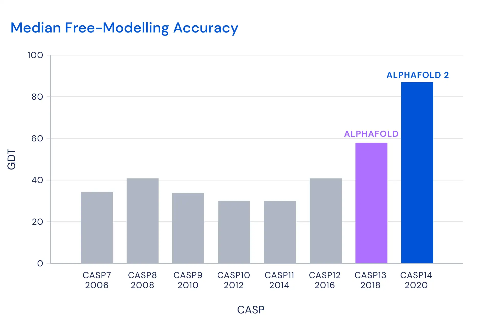
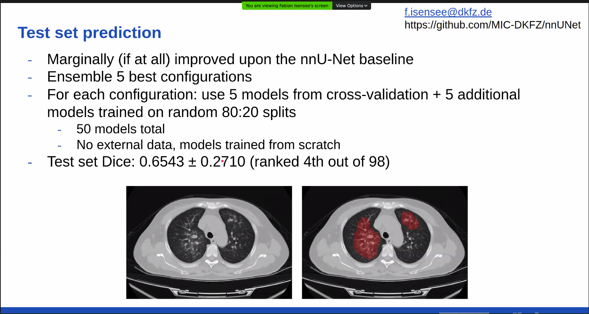
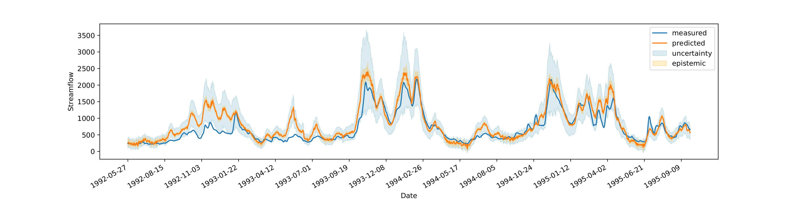

# An introduction to ...

## what? { style="font-size: 1.75em;" }

:::::::::::::: {.columns}

::: {.column width="30%" }

<i class="fas fa-chalkboard-teacher fa-5x"></i>

:::

::: {.column width="40%"}

data science,   
machine learning,   
deep learning

:::

::: {.column width="30%" }

<i class="fas fa-graduation-cap fa-5x"></i>

:::

::::::::::

## [Data Science](https://en.wikipedia.org/wiki/Data_science) { style="font-size: 1.75em;" }

> Data science is an inter-disciplinary field that uses scientific methods, processes, algorithms and systems to extract knowledge and insights from many structural and unstructured data. Data science is related to data mining, machine learning and big data. 

## [Machine Learning](https://en.wikipedia.org/wiki/Machine_learning) { style="font-size: 1.75em;" }

> Machine learning (ML) is the study of computer algorithms that improve automatically through experience. It is seen as a part of artificial intelligence. Machine learning algorithms build a model based on sample data, known as "training data", in order to make predictions or decisions without being explicitly programmed to do so.

## [Deep Learning](https://en.wikipedia.org/wiki/Deep_learning) { style="font-size: 1.75em;" }

> Deep learning (also known as deep structured learning) is part of a broader family of machine learning methods based on artificial neural networks with representation learning. Learning can be supervised, semi-supervised or unsupervised.

## Putting it all together

{ width=70% }

# ML today

## [AlphaFold2](https://deepmind.com/blog/article/alphafold-a-solution-to-a-50-year-old-grand-challenge-in-biology)

{ width=70% }

## [Fighting Deseases with DL](https://covid-segmentation.grand-challenge.org/Mini-symposium/)

{ width=80% } 

## [Predicting River Tides](https://mlcdresden.gitlab.io/pages/2019/10/02/deephydro.html)

## ML has become a tool for science

&nbsp;

<i class="fas fa-tools fa-9x"></i><i class="fas fa-microscope fa-9x"></i>

# Teaching this introduction

## The [No Free Lunch Theorem](http://www.no-free-lunch.org/) by David Wolpert { style="font-size: 1.5em;" }
 
 &nbsp;
 
 > Averaged over all possible data generating distributions, every classification algorithm has the same error rate when classifying previously unobserved points.
 &nbsp;
 
 
 . . .
 
 &nbsp;
 
 
 >  How well you do is determined by how ‘aligned’ your learning algorithm P(h|d) is with the actual posterior, P(f|d). 
 
 
::: notes
 
 - Ian Goodfellow: No machine learning algorithm is universally any better than any other.
 
 - Extra: The most sophisticated algorithm we can conceive of has the same average performance (over
 all possible tasks) as merely predicting that every point belongs to the same class.
 
:::

## In the next 3 days ... { style="font-size: 1.5em;" }

&nbsp;

- 100 people
- not in one place due to pandemic
- all online (including distractions)
- from newbie to pro?

## What I can however aspire to ...

&nbsp;

<i class="fas fa-praying-hands fa-9x"></i>

## {data-background-image="images/jerry-zhang-aQx1sz3cbpQ-unsplash_1600x.jpg"}

<!-- https://unsplash.com/photos/aQx1sz3cbpQ -->

## {data-background-image="images/Fiordland-NewZealand-William-Patino.jpg"}

<!-- https://www.pexels.com/photo/aerial-photography-of-mountain-covered-with-thick-cloud-formation-2943226/ -->

## What you can expect ... { style="font-size: 1.5em;" }

- **[teaching for inclusion](https://computinged.wordpress.com/2020/07/27/proposal-2-to-change-cs-education-to-reduce-inequity-stop-allocating-rationing-or-curving-down-grades/)**  
,,Helping the students with less computing background succeed makes a much bigger difference for society long-term than does keeping entertained the most privileged students." (Mark Guzdial, 2020)

- adapted **[inverted classroom](https://en.wikipedia.org/wiki/Flipped_classroom)**
  + instructions as video (each learner decides the speed, can be completed outside class)
  + learning in teams - together
  + many exercises (more than you can complete)

## How this will work { style="font-size: 1.5em;" }

We set up **teams of about 10** learners!

:::::::::::::: {.columns}

::: {.column width="50%" }

__Each team__ ... 

+ has one instructor
+ has one zoom room
+ has one mattermost channel
+ has one hackmd pad for notes

:::

::: {.column width="50%"}

**There are 8 lessons!**

- each lesson designed for 1h
- during each lesson

  1. watch the video
  2. answer the check-your-learning together
  3. conduct an exercise (if time permits) 

:::

:::::::::::::::

## Your instructors { style="font-size: 1.75em;" }

&nbsp;

:::::::::::::: {.columns}

::: {.column width="50%" }

- Erik Buhmann
- Sascha Diefenbacher
- Manuel Sommerhalder
- William Korcari
- Tobias Lösche
- David Brunner

:::

::: {.column width="50%"}

- Mykyta Shchedrolosiev
- Jonas Rübenach
- Oleg Filatov
- Moritz Scham
- Lucas Wiens

:::

:::::::::::::::

&nbsp;

**Thank you!**

# Summary

## Enjoy {style="font-size: 1.75em"}

&nbsp;

- be positive
- help each-other
- communicate 
- decide together

&nbsp;

*Thank you for your Attention!*  
*Questions, Concerns, Feedback?*
